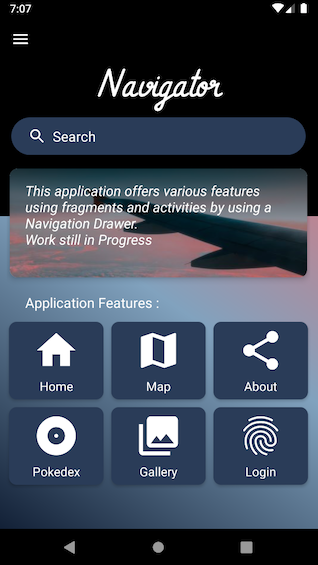
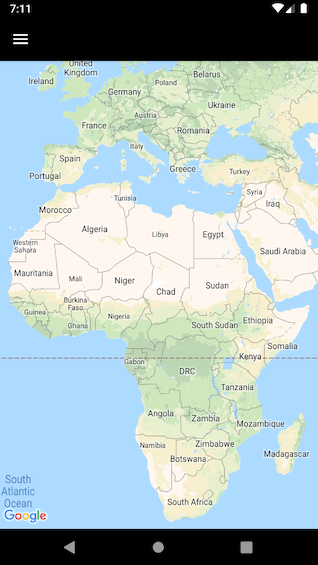

# Navigator
### by Weezya


- Application Mobile Android réalise avec Android Studio
- Navigateur d'activités et de fragments en Front-End
- Projet d'étude 4A à l'ESIEA encadré par M. VINCENT (Dev Mobile chez ENGIE)
- Approfondissement de bases de programmation mobile vues en 3A

https://github.com/Weezya/Navigator

## Table of Contents

* [Démonstration](#Démonstration)
* [Fonctionnalités détaillées](#Fonctionnalités-détaillées)
* [Design](#Design)
* [Catalogue de Navigator](#Catalogue-de-Navigator)
* [Démarche de développement Mobile](#Démarche-de-développement-Mobile)
* [Structuration du projet](#Structuration-du-projet)


## Démonstration


## Fonctionnalités détaillées

Ce projet a été créé avec l’activité Navigation Drawer générée par Android Studio comprenant un menu avec 6 éléments : Home, Map, About, Pokedex, Gallery et Login. Il y a également deux activités complémentaires : Splash et ItemData
 

- 3 Fragments fonctionnant dans l’activité Main
    - Home = Écran d'accueil simple
        - NestedScrollView + CardView + RelativeLayout + ...
    - Map = Service de cartographie en ligne
        - Généré avec Android Studio
        - Google API Service avec accès Internet
        - Création d'une clé API
            - https://console.developers.google.com/?hl=FR
    - About = Informations sur Navigator
        - Signature de l'application
        - Rappel des fonctionnalités
        - LinearLayout simple et efficace

- 3 activités attachées au menu
    - Pokedex = Liste des 964 Pokémons
        - Instance de Pokémon et adaptateur pour chaque
        - Call de l'API avec Retrofit et conversion GSON avec accès Internet
            - https://pokeapi.co/api/v2/
        - Call d'une seconde API pour les images avec Glide
            - https://pokeres.bastionbot.org/images/pokemon/
        - Gestion de Layout avec une grille de 3 colonnes
        - Chargement par blocs de 20 avec le Scroll
        - RecyclerView + AppBar/Toolbar + ...
    - Gallery = Liste de paysages
        - Hard coded data with Adapter : Name, Place, Description, Image
        - Adaptateur pour chaque élément de la liste
        - Calendrier au-dessus de la liste
        - ListView + CardView + ConstraintLayout + CoordinatorLayout + ...
    - Login = Page d'authentification
        - Généré avec Android Studio
        - Retourne une notification "Welcome back Satoshi" après connexion
        - Page d’enregistrement manquante
        - LinearLayout + EditText + Button + ...


- 1 activité lancée au démarrage de l'application
    - Splash = Chargement de l'application
        - Animation appliquée au logo et au titre
        - Attente de 5 secondes pour laisser le chargement finir

- 1 activité lancée via Gallery
    - ItemData = Informations sur un paysage
        - Ouverture du détail lors de la sélection d'un élément dans Gallery
        - Utilisation d'un Intent pour traduire les données de la liste
        - CollapsingToolbarLayout + NestedScrollView + CardView + ...


## Design

- Travail effectué tout au long du projet et à la fin pour les tests d'affichage
- Le travail sur XML met parfois plus de temps que la programmation du Java
- Différents éléments personnalisé et cherché sur Internet :
    - colors + size + fonts
    - icones + photos + parallax + buttons
    - gradients + animations
    - layout management

Découverte des shimmer Facebook (Work in Progress)


## Catalogue de Navigator


| Splash       | Menu           | Home          |
|     :---:    |     :---:      |     :---:     |
||||

| Map          | About          | Pokedex       |
|     :---:    |     :---:      |     :---:     |
||||

| Gallery      | ItemData       | Login         |
|     :---:    |     :---:      |     :---:     |
||||


## Démarche de développement Mobile

* Début : Navigation Drawer
    - Premier prototype d'application effectué pendant les vacances avec l'activité Navigation Drawer
    - Problèmes rencontrés en reprenant le projet de l'année dernière
    - Beaucoup de mises à jour de code nécessaires pour le refaire fonctionner


* Pokedex
    - Reprise des éléments de l'ancien projet Pokedex pour appeler l'API et l'afficher dans sa RecyclerView

* Map
    - Création facile et intuitive de l'activité Maps avec Android Studio 
    - Récupération d'une clé API sur le site de Google

* Gallery
    - Partir à la conquête de sa propre liste écrite en dur
    - Afficher le détail de chaque élément dans une nouvelle activité

* Home et Login
    - Plusieurs pirouettes et jeux de jambes sur clavier avec divers tutoriels
    - Beaucoup d'idées et de changements pour arriver à un produit final

* Fin : About
    - Rappels des fonctionnalité et Signature de l'application


Il faut bien comprendre les dépendances et la configuration de son projet avant de se lancer dans le développement de celui-ci car maîtriser son code facilite la correction en cas d'erreurs ou de conflits. Il est important aussi de bien assimiler la différence entre un fragment et une activité avant de se lancer au propre dans un nouveau projet tel que la Navigation Drawer.

Entre les systèmes Windows et Mac, Android Studio ne génère pas la même activité Navigation Drawer : sur Mac on a une structure simple avec une seule activité et un menu à compléter soi-même alors que sur Windows il génère également chaque fragment avec une structure légèrement différente.

Il faut toujours faire un backup avant de faire des folies avec son code : soit tout le projet entre chaque grandes étapes, soit des bouts de codes pour les changements partiels. Sublime Text est un très bon outil pour cela et il possède des codes couleurs pour s'y retrouver et comparer des lignes. Beaucoup de problèmes sont résolus après avoir tourné en rond autour de la solution.

Le projet est toujours en voie de développement.

> "Work still in Progress"


## Structuration du projet

- Architecture MVC (Model View Controller)
- Beaucoup de ressources pour le design

```
Android
├───App
│   │ 
│   ├───AndroidManifest
│   │   
│   ├───java.com.example.navigator
│   │   │  
│   │   ├───Models
│   │   │       LoggedInUser
│   │   │       LoggedInUserView
│   │   │       LoginFormeState
│   │   │       LoginResult
│   │   │       LoginViewModel
│   │   │       LoginViewModelFactory
│   │   │       Pokemon
│   │   │       PokemonRequest
│   │   │       
│   │   ├───Views
│   │   │       AboutFragment
│   │   │       HomeFragment
│   │   │       ItemdataActivity
│   │   │       ListActivity
│   │   │       LoginActivity
│   │   │       MainActivity
│   │   │       MapsFragment
│   │   │       PokedexActivity
│   │   │       SplashActivity
│   │   │       
│   │   ├───Controller    
│   │   │       LoginDataSource
│   │   │       LoginRepository
│   │   │       PokeAdapter
│   │   │       PokeapiService
│   │   │       Result
│   │   │       
│   │   └─── . . .
│   │   
│   └───res
│       │
│       ├───anim
│       │       transitionstart.xml
│       │       transitionstart2.xml
│       │
│       ├───drawable
│       │       *.jpg . . .
│       │       *.png . . .
│       │       *.xml . . .
│       │       gratient*.xml . . .
│       │       ic_*.xml . . .
│       │       menu_*.xml . . .
│       │       log_*.png . . .
│       │   
│       ├───drawable
│       │       atma_light.ttf
│       │       vibur.ttf
│       │       atma_medium.xml
│       │       atma.xml
│       │       alegreya_sans_sc_thin.xml
│       │       damion.xml
│       │       dosis_light.ttf
│       │       dosis.ttf
│       │       dosis_extralight.xml
│       │       aldrich.xml
│       │       advent_pro.xml
│       │   
│       ├───layout
│       │       activity_list.xml
│       │       activity_login.xml
│       │       activity_main.xml
│       │       activity_pokedex.xml
│       │       activity_splash.xml
│       │       fragment_about.xml
│       │       fragment_home.xml
│       │       fragment_maps.xml
│       │       home_features_grid.xml
│       │       list_item_data.xml
│       │       list_item_row.xml
│       │       main_nav_header.xml
│       │       pokedex_item.xml
│       │   
│       ├───menu
│       │       activity_main_drawer.xml
│       │       main.xml
│       │       
│       ├───mipmap
│       │       ic_*.png . . .
│       │       ic_*.xml . . .
│       │       log_*.png . . .
│       │   
│       └───values
│               colors.xml
│               dimens.xml
│               drawables.xml
│               font_certs.xml
│               google_maps_api.xml
│               ic_navigator_background.xml
│               preloaded_fonts.xml
│               strings.xml
│               styles.xml
│
└───Gradle
```
